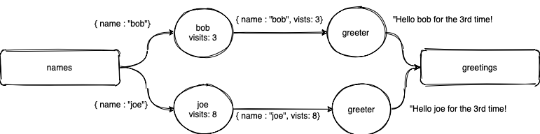

# The Greeter Example

This is a simple example of a stateful functions application implemented in `Python`.

In this example, we imagine a service that computes personalized greetings.
Our service, consist out of the following components:

* `playground ingress` - Ingestion point for messages. Messages are sent to the specified target function.

* `person` - This function is triggered by the ingress defined above.
This function keeps track of the number of visits, and triggers the next functions:

* `greeter` - This function, computes a personalized greeting, based on the name and the number
of visits of that user. The output of that computation is forward to a Kafka egress defined below.

* `playground egress` - Queryable endpoint that collects the emitted greetings in the `greetings` topic. The greeting is `utf-8` encoded.




## Running the example

```
$ docker-compose build
$ docker-compose up
```

## Play around!

The greeter application allows you to do the following actions:

* Create a greeting for a user via sending a `GreetRequest` message to the `person` function

In order to send messages to the Stateful Functions application you can run:

```
$ curl -X PUT -H "Content-Type: application/vnd.example/GreetRequest" -d '{"name": "Bob"}' localhost:8090/example/person/Bob
```

To consume the customized greeting, as they appear in the `greetings` playground topic, run in a separate terminal:

```
$ curl -X GET localhost:8091/greetings
```

### Messages

The messages are expected to be encoded as JSON.

* `GreetRequest`: `{"name": "Bob"}`, `name` is the id of the `person` function

## What's next?

Feeling curious? add the following print to the `person` function at [functions.py](functions.py):
```
print(f"Hello there {context.address.id}!", flush=True)
```

Then, rebuild and restart only the `functions` service.

```
docker-compose build functions
docker-compose up functions
```
